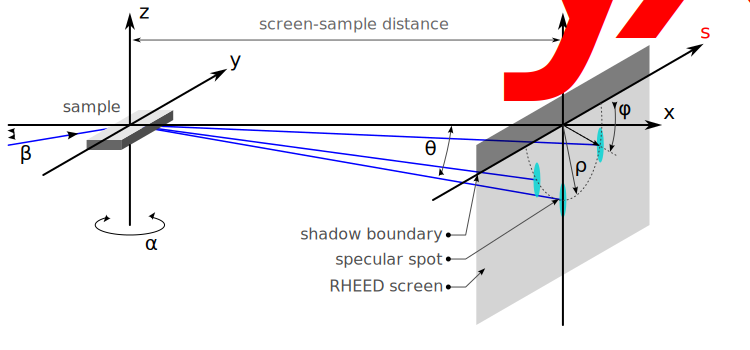

Geometry
========

The schematic below illustrates the experimental geometry employed in the **xRHEED** package:

To determine the positions of diffraction spots for a given surface lattice and experimental configuration, the first step is to compute the angles :math:`\varphi` and :math:`\theta` at each intersection point between the Ewald sphere and the reciprocal lattice rods.

These angular coordinates are then used to calculate the corresponding spot positions :math:`S_x` and :math:`S_y` on the RHEED screen in real space.

The angles are defined analogously to spherical coordinates; however, in this context, :math:`\theta` is measured with respect to the :math:`x` axis (rather than the conventional :math:`z` axis).
