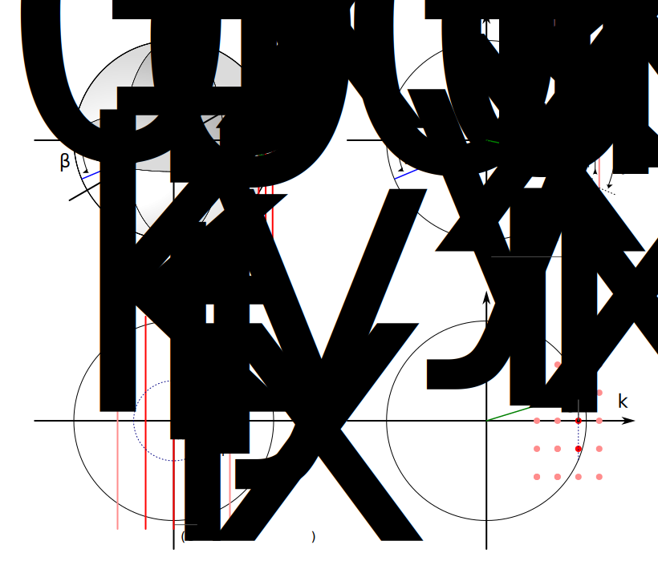

Kinematic Diffraction Model
===========================

Ewald Sphere in Reciprocal Space
--------------------------------

The reciprocal lattice corresponding to a two-dimensional real-space lattice consists of an array of rods oriented perpendicular to the crystal surface plane.

Diffraction spots are observed in directions defined by the intersection points between the Ewald sphere and these reciprocal lattice rods, as illustrated in the sketch below:

.. note::
   Although it is common practice to depict the sample, screen, and Ewald construction within a single schematic, this approach can be misleading, as it conflates real-space and reciprocal-space representations.

Algorithm for Calculating :math:`\theta` and :math:`\varphi`
-------------------------------------------------------------

1. **Compute the Ewald sphere radius** for electron energy :math:`E` in eV:

   .. math::

      k_0 = \sqrt{E} \cdot 0.5123

2. **Generate reciprocal lattice** in the (x, y) plane, denoted as :math:`g_x` and :math:`g_y`.

3. **Shift the reciprocal lattice** along the :math:`k_x` direction to align the specular reflection with the intersection point between the lattice rods and the Ewald sphere.  
   The shift is calculated using:

   .. math::

      \delta_x = k_0 \cdot \cos(\beta)

   This yields the shifted reciprocal lattice coordinates named as :math:`k_x` and :math:`k_y`.

4. **Filter reciprocal lattice rods** to retain only those located within the Ewald sphere, i.e., those whose distance from the sphere center is less than its radius. Only these rods can intersect the sphere.

5. **Calculate the projected radius** :math:`r_k` for each reciprocal lattice point:

   .. math::

      r_k = \sqrt{k_0^2 - k_x^2}

6. **Determine the diffraction angles** using the following relations:

   .. math::

      \theta = \arcsin{\left(\frac{r_k}{k_0}\right)}

   .. math::

      \varphi = \arccos{\left(\frac{k_x}{r_k}\right)}

7. **Compute the diffraction spot radius** on the screen:

   .. math::

      \rho = L \cdot \tan(\theta)

   where :math:`L` is the sample-to-screen distance.

8. **Convert to screen coordinates** :math:`(s_x, s_y)`:

   .. math::

      s_x = \rho \cdot \cos(\varphi)

   .. math::

      s_y = \rho \cdot \sin(\varphi)
