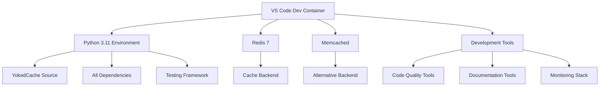

# 🐳 YokedCache .devcontainer Setup

A complete containerized development environment for YokedCache with Redis, Memcached, and all development tools.

## 📁 Files Overview

```
.devcontainer/
├── devcontainer.json           # VS Code Dev Container configuration
├── docker-compose.yml          # Multi-service container orchestration
├── Dockerfile                  # Python development environment
├── post-create.sh             # Automated setup script
├── dev.sh                     # Development helper script
├── redis.conf                 # Redis server configuration
├── prometheus.yml             # Prometheus monitoring config
├── grafana-datasources.yml    # Grafana data sources
├── .dockerignore              # Docker build optimization
├── README.md                  # Detailed documentation
└── OVERVIEW.md                # This file
```

## 🚀 Quick Start

1. **Prerequisites**: Docker Desktop + VS Code + Dev Containers extension
2. **Open**: `F1` → "Dev Containers: Reopen in Container"
3. **Wait**: Initial build takes ~5-10 minutes
4. **Develop**: Everything is ready to go!

## 🛠️ What You Get

### Core Development Environment
- **Python 3.11** with conda
- **Redis 7** for caching
- **Memcached** for alternative backend
- **All dependencies** pre-installed
- **YokedCache** installed in development mode

### VS Code Integration
- **30+ Extensions** for Python development
- **Intelligent code completion** with Pylance
- **Automated formatting** with Black and isort
- **Type checking** with mypy
- **Testing integration** with pytest
- **Git integration** with GitLens

### Development Tools
- **Pre-commit hooks** for code quality
- **Coverage reporting** with pytest-cov
- **Documentation building** with MkDocs
- **CLI tools** for cache management
- **Development helper script** (`./dev.sh`)

### Optional Services
- **Redis Insight** - Redis GUI on port 8001
- **Prometheus** - Metrics collection on port 9090
- **Grafana** - Metrics visualization on port 3000

## 🔧 Common Commands

```bash
# Development workflow
./dev.sh setup          # Install in development mode
./dev.sh test           # Run tests
./dev.sh format         # Format code
./dev.sh lint           # Run linting
./dev.sh quality        # All quality checks

# Cache operations
./dev.sh ping           # Test Redis connection
./dev.sh stats          # Cache statistics
./dev.sh redis-cli      # Connect to Redis

# Documentation
./dev.sh docs           # Build docs
./dev.sh docs-serve     # Serve docs with live reload

# Services
./dev.sh monitor        # Start Prometheus + Grafana
./dev.sh tools          # Start Redis Insight
./dev.sh status         # Show service status
```

## 🌐 Service URLs

- **Redis**: `redis://redis:56379`
- **Memcached**: `memcached:11211`
- **Redis Insight**: <http://localhost:58001>
- **Prometheus**: <http://localhost:59090>
- **Grafana**: <http://localhost:53000> (admin/admin)
- **Documentation**: <http://localhost:58080> (when serving)

## 📋 Environment Variables

Pre-configured for development:

```bash
YOKEDCACHE_REDIS_URL=redis://redis:56379/0
YOKEDCACHE_DEFAULT_TTL=300
YOKEDCACHE_KEY_PREFIX=dev_yokedcache
YOKEDCACHE_LOG_LEVEL=DEBUG
YOKEDCACHE_ENABLE_METRICS=true
YOKEDCACHE_PROMETHEUS_PORT=58000
PYTHONPATH=/workspace/src
```

## 🏗️ Architecture



## 🔍 Troubleshooting

### Container Issues
```bash
# Rebuild container
F1 → "Dev Containers: Rebuild Container"

# Check Docker resources
docker system df
docker stats
```

### Service Issues
```bash
# Check service status
./dev.sh status

# View service logs
./dev.sh logs redis
./dev.sh logs memcached

# Restart services
./dev.sh restart
```

### Python Environment
```bash
# Verify environment
conda info --envs
python --version
pip list | grep yokedcache

# Reinstall development package
./dev.sh setup
```

## 🚀 Advanced Usage

### Adding New Dependencies
1. Add to `requirements-dev.txt`
2. Rebuild container or run `pip install package`

### Custom VS Code Settings
Edit `devcontainer.json` → `customizations.vscode.settings`

### Service Configuration
- **Redis**: Edit `redis.conf`
- **Monitoring**: Edit `prometheus.yml`
- **Compose**: Edit `docker-compose.yml`

### Environment Customization
Add environment variables to `devcontainer.json` → `containerEnv`

## 📊 Monitoring & Metrics

When monitoring is enabled:

1. **Prometheus** collects metrics from YokedCache
2. **Grafana** visualizes cache performance
3. **Redis Insight** provides Redis-specific monitoring

Access dashboards:
- Prometheus: <http://localhost:59090/targets>
- Grafana: <http://localhost:53000/dashboards>
- Redis Insight: <http://localhost:58001>

## 🎯 Development Best Practices

1. **Use the helper script**: `./dev.sh` for common tasks
2. **Run tests frequently**: `./dev.sh test`
3. **Format before committing**: `./dev.sh format`
4. **Check code quality**: `./dev.sh quality`
5. **Monitor cache health**: `./dev.sh ping` and `./dev.sh stats`

## 📚 Resources

- [YokedCache Documentation](https://sirstig.github.io/yokedcache)
- [VS Code Dev Containers](https://code.visualstudio.com/docs/remote/containers)
- [Docker Compose](https://docs.docker.com/compose/)
- [Redis Documentation](https://redis.io/documentation)

---

**Happy coding! 🎉** This environment provides everything you need for productive YokedCache development.
