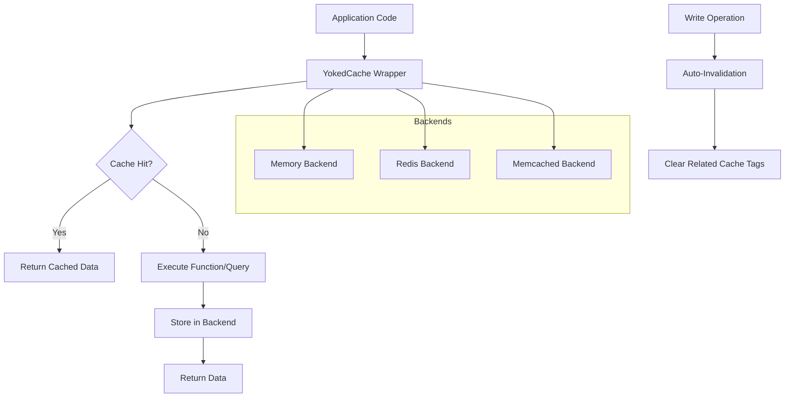

# Core Concepts

Understanding YokedCache's core concepts will help you use it effectively and troubleshoot issues when they arise.

## Architecture Overview

YokedCache follows a simple but powerful architecture:



## Cache Keys

Cache keys are unique identifiers for cached values. YokedCache builds keys systematically to ensure consistency and prevent conflicts.

### Key Structure

All cache keys follow this pattern:
```
{key_prefix}:{context}:{hash}
```

- **key_prefix**: Configurable namespace (default: `yokedcache`)
- **context**: Function name, table name, or operation type
- **hash**: Stable hash of arguments/parameters

### Key Generation

YokedCache automatically generates keys using several inputs:

```python
from yokedcache.utils import generate_cache_key

# Function caching
key = generate_cache_key(
    prefix="myapp",
    function_name="get_user",
    args=(123,),
    kwargs={"active": True}
)
# Result: "myapp:get_user:a1b2c3d4..."

# Database query caching
key = generate_cache_key(
    prefix="myapp",
    table="users",
    query="SELECT * FROM users WHERE id = ?",
    params=[123]
)
# Result: "myapp:users:query:e5f6g7h8..."
```

### Key Sanitization

Keys are automatically sanitized to ensure compatibility with all backends:

- Non-ASCII characters are encoded
- Special characters are escaped or replaced
- Length is limited to prevent backend issues
- Dangerous patterns are removed

```python
from yokedcache.utils import sanitize_key

# Automatically applied to all generated keys
safe_key = sanitize_key("my-app:user:josé@example.com")
# Result: "my-app:user:jos__at__example.com"
```

## TTL and Expiration

Time-To-Live (TTL) controls how long cache entries remain valid.

### TTL Calculation

YokedCache applies jitter to TTL values to prevent thundering herd problems:

```python
from yokedcache.utils import calculate_ttl_with_jitter

# Base TTL: 300 seconds, Jitter: 10%
actual_ttl = calculate_ttl_with_jitter(300, jitter_percent=10.0)
# Result: 270-330 seconds (random within range)
```

### TTL Sources

TTL values are determined in this order of precedence:

1. **Explicit TTL**: Passed directly to cache operations
2. **Table-specific TTL**: Configured per table in config
3. **Default TTL**: Global default from configuration
4. **Backend default**: Backend-specific fallback

```python
# Explicit TTL (highest precedence)
await cache.set("key", value, ttl=600)

# Table-specific TTL in config
config = CacheConfig(
    tables={
        "users": TableCacheConfig(ttl=3600),
        "products": TableCacheConfig(ttl=1800)
    }
)

# Global default TTL
config = CacheConfig(default_ttl=300)
```

### TTL Best Practices

- **Hot data**: Short TTL (30-300 seconds) for frequently changing data
- **Cold data**: Long TTL (1-24 hours) for stable reference data
- **User sessions**: Medium TTL (15-60 minutes) for user-specific data
- **Always use jitter**: Prevents synchronized cache misses

## Tags and Grouping

Tags allow you to group related cache entries and perform bulk operations.

### Tag Structure

Tags are simple string identifiers that group related cache entries:

```python
# Table-based tags (automatic)
"table:users"
"table:products"

# Feature-based tags (manual)
"user_data"
"product_catalog"
"session_data"

# Composite tags
"user:123"
"tenant:company_a"
```

### Automatic Tagging

YokedCache automatically applies tags based on context:

```python
# Function caching with explicit tags
@cached(ttl=300, tags=["user_data", "api_v1"])
async def get_user_profile(user_id: int):
    return fetch_user_from_db(user_id)

# Database dependency caching (automatic table tags)
cached_get_db = cached_dependency(
    get_db,
    cache=cache,
    ttl=300,
    table_name="users"  # Automatically adds "table:users" tag
)
```

### Tag-Based Operations

Tags enable powerful bulk operations:

```python
# Invalidate all user-related data
await cache.invalidate_tags(["user_data", "table:users"])

# Invalidate specific user's data
await cache.invalidate_tags([f"user:{user_id}"])

# Search by tags
results = await cache.fuzzy_search("john", tags={"user_data"})

# Pattern-based invalidation
await cache.invalidate_pattern("user:*")
```

## Auto-Invalidation

Auto-invalidation automatically clears cache entries when related data changes.

### How It Works

1. **Read Operations**: Cached with appropriate tags
2. **Write Operations**: Tracked and queued for invalidation
3. **Transaction Commit**: Triggers invalidation of affected tags
4. **Cache Cleared**: Related entries removed from cache

```python
# Setup auto-invalidation
cached_get_db = cached_dependency(
    get_db,
    cache=cache,
    ttl=300,
    table_name="users"
)

# Read operation (cached with "table:users" tag)
@app.get("/users/{user_id}")
async def get_user(user_id: int, db=Depends(cached_get_db)):
    return db.query(User).filter(User.id == user_id).first()

# Write operation (triggers invalidation on commit)
@app.post("/users")
async def create_user(user: UserCreate, db=Depends(cached_get_db)):
    new_user = User(**user.dict())
    db.add(new_user)
    await db.commit()  # Auto-invalidates "table:users" tag
    return new_user
```

### Table Detection

YokedCache automatically detects affected tables from SQL queries:

```python
# Simple patterns detected automatically
"SELECT * FROM users WHERE id = ?"           # → users
"INSERT INTO products (name) VALUES (?)"     # → products
"UPDATE orders SET status = ? WHERE id = ?"  # → orders
"DELETE FROM sessions WHERE expired < ?"     # → sessions
```

For complex queries, specify tables explicitly:

```python
cached_get_db = cached_dependency(
    get_db,
    cache=cache,
    ttl=300,
    table_name="users"  # Explicit table specification
)
```

## Serialization

YokedCache supports multiple serialization methods for different use cases.

### Serialization Methods

```python
from yokedcache.models import SerializationMethod

# JSON (default) - Best for simple data and interoperability
await cache.set("key", {"name": "John"}, serialization=SerializationMethod.JSON)

# Pickle - Best for complex Python objects
await cache.set("key", complex_object, serialization=SerializationMethod.PICKLE)

# MessagePack - Best for binary efficiency
await cache.set("key", data, serialization=SerializationMethod.MSGPACK)
```

### JSON Serialization

JSON is the default serialization method with custom encoders for common Python types:

```python
# Automatically handles these types
data = {
    "timestamp": datetime.now(),
    "tags": {"user", "active"},  # Sets converted to lists
    "decimal": Decimal("123.45"),
    "uuid": uuid4()
}

await cache.set("key", data)  # Automatically serialized
result = await cache.get("key")  # Automatically deserialized
```

### Custom Serialization

Configure serialization per operation or globally:

```python
# Per-operation
await cache.set("key", data, serialization=SerializationMethod.PICKLE)

# Per-table configuration
config = CacheConfig(
    tables={
        "users": TableCacheConfig(
            serialization_method=SerializationMethod.JSON
        ),
        "sessions": TableCacheConfig(
            serialization_method=SerializationMethod.PICKLE
        )
    }
)
```

### Serialization Best Practices

- **JSON**: Use for simple data types, APIs, and cross-language compatibility
- **Pickle**: Use for complex Python objects, but only within Python ecosystems
- **MessagePack**: Use for binary efficiency and cross-language support
- **Consistency**: Use the same serialization method for related data

## Error Handling and Resilience

YokedCache is designed to fail gracefully and maintain application stability.

### Graceful Degradation

When cache operations fail, YokedCache falls back to the original function:

```python
@cached(ttl=300)
async def get_expensive_data():
    # If cache fails, function still executes normally
    return expensive_computation()
```

### Circuit Breaker Pattern

YokedCache implements circuit breaker patterns to prevent cascade failures:

- **Closed**: Normal operation, cache working
- **Open**: Cache failing, bypass cache temporarily
- **Half-Open**: Testing if cache has recovered

### Logging and Monitoring

Comprehensive logging helps with debugging and monitoring:

```python
import logging

# Configure YokedCache logging
logging.getLogger("yokedcache").setLevel(logging.INFO)

# Log levels:
# DEBUG: Detailed operation logs
# INFO: Key operations and stats
# WARNING: Recoverable issues
# ERROR: Serious problems
```

## Performance Considerations

### Memory Usage

- **Key Efficiency**: Keep keys descriptive but concise
- **Value Size**: Avoid storing very large objects; consider pagination
- **TTL Strategy**: Balance freshness vs. performance

### Connection Management

- **Connection Pooling**: YokedCache maintains connection pools automatically
- **Pool Sizing**: Configure `max_connections` based on concurrency needs
- **Async Operations**: Use async/await consistently for best performance

### Batch Operations

YokedCache optimizes batch operations internally:

```python
# These are automatically batched
await cache.set_many({
    "key1": value1,
    "key2": value2,
    "key3": value3
}, ttl=300)

# Tag operations are batched
await cache.invalidate_tags(["tag1", "tag2", "tag3"])
```

## Configuration

Core concepts can be configured globally or per-operation:

```python
from yokedcache import CacheConfig, YokedCache

config = CacheConfig(
    # Global settings
    default_ttl=300,
    key_prefix="myapp",

    # Performance settings
    max_connections=50,

    # Table-specific settings
    tables={
        "users": TableCacheConfig(
            ttl=3600,
            tags={"user_data"},
            serialization_method=SerializationMethod.JSON
        )
    }
)

cache = YokedCache(config=config)
```

Understanding these core concepts will help you design effective caching strategies and troubleshoot issues when they arise. Next, explore the [Configuration Guide](configuration.md) for detailed setup options.
